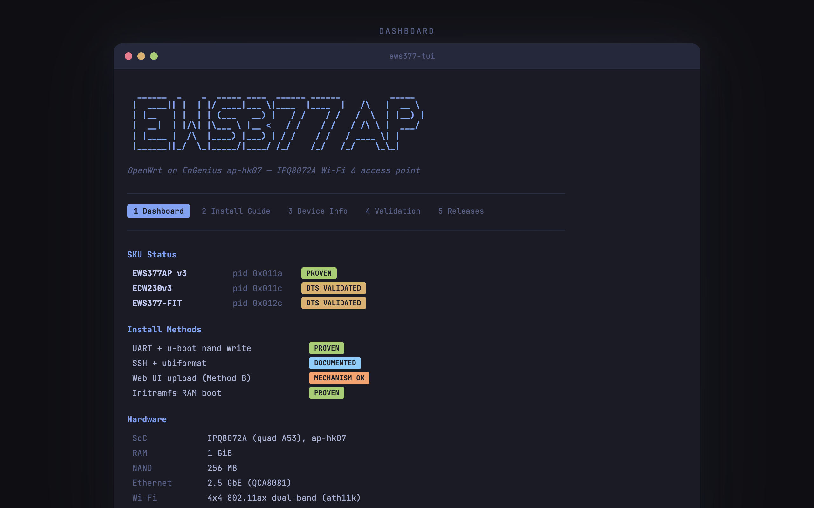
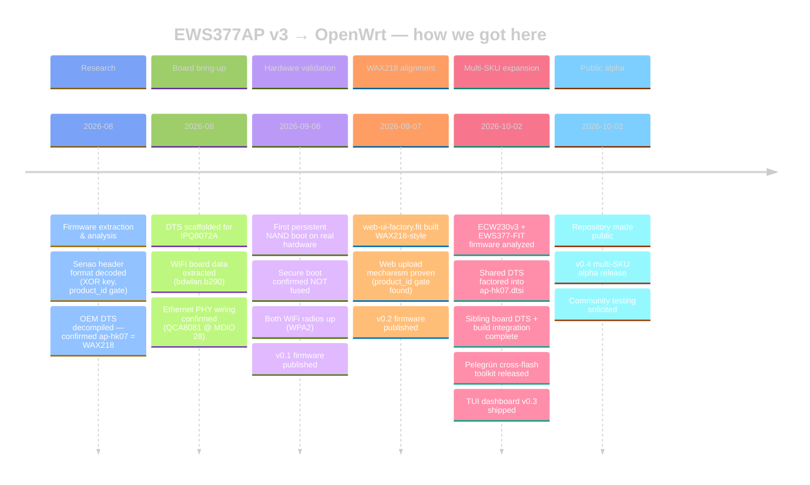

<div align="center">

# OpenWrt for EnGenius EWS377AP v3 · ECW230v3 · EWS377-FIT

**Full hardware-accelerated OpenWrt on EnGenius `ap-hk07` Wi-Fi 6 access points**

[](https://github.com/ParkWardRR/openwrt-engenius-ews377ap-ecw230-ews377fit/releases)
[](LICENSE)
[](#status)
[](#supported-models)
[](#what-you-get)
[](https://github.com/ParkWardRR/openwrt-nss-edma)
[](#hardware-at-a-glance)
[](#hardware-at-a-glance)
[](#hardware-at-a-glance)
[](https://github.com/ParkWardRR/openwrt-engenius-ews377ap-ecw230-ews377fit/issues)
[](#help-wanted)

<br/>



<br/>

**[Install Guide](docs/install-and-restore.md)** · **[Downloads](https://github.com/ParkWardRR/openwrt-engenius-ews377ap-ecw230-ews377fit/releases)** · **[Roadmap](docs/ROADMAP.md)** · **[ELI5 Guide](docs/wiki/ELI5-Guide.md)** · **[FAQ](docs/wiki/FAQ.md)** · **[Report Issue](https://github.com/ParkWardRR/openwrt-engenius-ews377ap-ecw230-ews377fit/issues/new)**

</div>

---

## What this is

Community-built **OpenWrt** with **Qualcomm NSS hardware offload** for three EnGenius access points that share the same `ap-hk07` board (Qualcomm IPQ8072A). These are enterprise-grade 4×4 Wi-Fi 6 APs with a 2.5 GbE uplink — and they run the same silicon as the [officially-supported NETGEAR WAX218](docs/wax218-equivalence.md).

This is an **alpha release**. We are soliciting feedback and hardware testing from the community. If you own one of these APs and want to help, see [Help Wanted](#help-wanted).

## What you get

- **Full OpenWrt** — LuCI web UI, opkg packages, standard config
- **NSS hardware offload** — NAT, bridge, PPPoE, SQM, and Wi-Fi offload handled by the dedicated network subsystem processor, not the CPU
- **Both Wi-Fi radios** — 4×4 802.11ax dual-band (ath11k), DFS certified
- **2.5 GbE uplink** — QCA8081 PHY, link speeds up to 2500 Mbps
- **Persistent install** — boots from NAND, survives reboots, supports sysupgrade
- **Back-to-stock** — documented restore path to OEM firmware
- **Cross-flash tools** — [Pelegrún](https://github.com/ParkWardRR/pelegrun-ap-hk07-firmware-tools) handles SKU conversion (EWS ↔ ECW ↔ FIT) over the network, no UART needed

## Status

> **Alpha — validated on EWS377AP v3 hardware. ECW230v3 and EWS377-FIT awaiting community testers.**

OpenWrt boots and runs **persistently from NAND** on a real EWS377AP v3: `bootipq` → FIT `config@hk07` → kernel → UBI root → squashfs + overlay → shell. Ethernet, both Wi-Fi radios (WPA2), and config persistence all confirmed. Secure boot is **not fused**.

ECW230v3 and EWS377-FIT are confirmed identical hardware (same DTS properties, same GPIOs, same PHY, same Wi-Fi calibration ID) but have **not been tested on physical units**. We need your help.

## Supported models

| Model | Product ID | Management mode | Hardware test status |
|---|---|---|---|
| **EWS377AP v3** | `0x011a` (282) | Controller (EWS/ezMaster) | **Proven** — persistent NAND boot, Wi-Fi, Ethernet |
| **ECW230v3** | `0x011c` (284) | Cloud (EnGenius Cloud) | **Untested** — DTS-validated, identical silicon |
| **EWS377-FIT** | `0x012c` (300) | Standalone | **Untested** — DTS-validated, identical silicon |

All three share identical silicon, LEDs, reset GPIO, Wi-Fi board data, Ethernet PHY, and the `config@hk07` boot contract. They differ only in their Senao firmware header `product_id`. See [`reference/model-differences.md`](reference/model-differences.md).

The **NETGEAR WAX218 v1** is the same `ap-hk07` reference board and is [officially supported by mainline OpenWrt](docs/wax218-equivalence.md).

## Downloads

Firmware images + `SHA256SUMS` → **[Releases](https://github.com/ParkWardRR/openwrt-engenius-ews377ap-ecw230-ews377fit/releases)**

| File | Purpose | Status |
|---|---|---|
| `…-squashfs-factory.ubi` | UART/u-boot `nand write` or SSH `ubiformat` to slot 0 | **Hardware-proven** (UART) |
| `…-initramfs-uImage.itb` | RAM boot — dry-run / recovery, nothing written to NAND | **Proven** |
| `…-squashfs-sysupgrade.bin` | Upgrade once already running OpenWrt | Standard |
| `…-web-ui-factory.fit` | OEM web GUI one-click install (same build method as mainline WAX218) | **Experimental** — [details below](#web-upload-status) |

### Web upload status

The OEM web upload mechanism (`upload.cgi`) works — it accepts, stages, and flashes a correctly-headed image. The earlier "rejects everything" finding was a `product_id` mismatch, not a protocol issue. However, persistence has not been confirmed: the one test unit has a bad NAND block in the spare slot. **If you have a second unit, [we need your help](https://github.com/ParkWardRR/openwrt-engenius-ews377ap-ecw230-ews377fit/issues/1).**

Full writeup: [`reference/method-b-findings.md`](reference/method-b-findings.md).

## Before you flash

- **You can brick your AP.** This is unofficial firmware. Single-slot install overwrites OEM.
- **Only UART/u-boot install is hardware-proven** on EWS377AP v3. All other paths are experimental.
- **Back up your NAND first.** Your MAC address and radio calibration (ART partition) are unique and irreplaceable.
- **Never write the ART partition or bootloader region** (`0x0`–`0x1000000`).
- **Verify `SHA256SUMS`** before flashing.

The **[install & back-to-stock guide](docs/install-and-restore.md)** covers UART (reliable), SSH (no cable), and web (easy) paths with every command spelled out.

## Hardware at a glance

Shared across all three models:

| Spec | Detail |
|---|---|
| **SoC** | Qualcomm IPQ8072A (quad Cortex-A53) |
| **RAM** | 1 GiB (confirmed live; some units report 512 MB) |
| **NAND** | 256 MB |
| **Wi-Fi** | 4×4 802.11ax dual-band (ath11k), FCC + ETSI DFS |
| **Ethernet** | Single 2.5 GbE `lan` uplink (QCA8081, USXGMII) |
| **LEDs** | RGB status — GPIO 54/55/56 |
| **Reset** | GPIO 52 (active-low) |
| **UART** | Header J2, 115200 8N1 (`ttyMSM0`) |
| **Boot** | QCA u-boot 2.0.0, `bootcmd=bootipq`, dual A/B slots |
| **Reference board** | `ap-hk07` (= NETGEAR WAX218 v1) |

## The two fixes that made it boot

Stock `qualcommax`/`ipq807x` OpenWrt needed exactly two board-specific adjustments:

1. **FIT config named `config@hk07`** — the OEM `bootipq` selects FIT config by board name and aborts otherwise. The officially-supported WAX218 ships the identical `config@hk07` — same reference board, same bootloader contract.
2. **Install to slot 0** — OpenWrt's root-mount targets the SMEM partition labeled `rootfs` (slot 0, `0x1000000`), regardless of which A/B slot booted the kernel.

## Cross-flash & controller migration

These three models are the same board with different firmware headers. To migrate between management modes (EWS → FIT, Cloud → standalone, etc.) or to install OpenWrt without UART:

**[Pelegrún](https://github.com/ParkWardRR/pelegrun-ap-hk07-firmware-tools)** — a no-brick toolkit (Rust + Go) that handles firmware re-heading, serial provisioning, and bootloader safety. Network-only, no UART needed. Includes a guided TUI.

For background on EnGenius controllers and firmware formats: **[EnGenius Field Guide](https://github.com/ParkWardRR/engenius-field-guide)**.

## ews377-tool — CLI utility

A Zig-native CLI ships in [`tui/`](tui/) — zero dependencies, single static binary.

```
ews377-tool info                          # hardware reference card, models, install methods
ews377-tool verify firmware.ubi [hash]    # SHA256-verify a firmware file
ews377-tool probe 192.168.1.100           # SSH to device — identify model, firmware, partitions
```

Build: `cd tui && zig build` — binary at `zig-out/bin/ews377-tool`.

## Help wanted

This is an alpha release. We need community testing to move forward. Here is what would help most:

| What | Who | How to report |
|---|---|---|
| **Flash ECW230v3 or EWS377-FIT** and report boot/Wi-Fi/Ethernet results | Anyone with one of these APs | [Open an issue](https://github.com/ParkWardRR/openwrt-engenius-ews377ap-ecw230-ews377fit/issues/new) |
| **Test web-upload persistence** on a second EWS377AP v3 unit | EWS377AP v3 owner | [Issue #1](https://github.com/ParkWardRR/openwrt-engenius-ews377ap-ecw230-ews377fit/issues/1) |
| **SSH + `ubiformat` install** (no UART) on any of the three models | Anyone comfortable with SSH | [Open an issue](https://github.com/ParkWardRR/openwrt-engenius-ews377ap-ecw230-ews377fit/issues/new) |
| **NSS throughput numbers** under real load (iperf3, SQM) | Anyone running this firmware | [Open an issue](https://github.com/ParkWardRR/openwrt-engenius-ews377ap-ecw230-ews377fit/issues/new) |
| **2.5 GbE speed validation** with a 2.5G switch partner | Anyone with 2.5G infrastructure | [Open an issue](https://github.com/ParkWardRR/openwrt-engenius-ews377ap-ecw230-ews377fit/issues/new) |
| **Bug reports, install issues, unclear docs** | Everyone | [Open an issue](https://github.com/ParkWardRR/openwrt-engenius-ews377ap-ecw230-ews377fit/issues/new) |

When reporting, include: model, firmware version, install method used, `ubus call system board` output, and a description of what happened vs. what you expected.

## Project timeline



## Documents

| Document | What's in it |
|---|---|
| **[Install & restore guide](docs/install-and-restore.md)** | Flash OpenWrt + restore to stock — UART, SSH, and web paths |
| **[Roadmap](docs/ROADMAP.md)** | WAX218 alignment strategy, multi-SKU plan, validation checklist |
| **[WAX218 equivalence](docs/wax218-equivalence.md)** | Same board as mainline OpenWrt's WAX218 — shared and differing traits |
| **[Hardware reference](docs/hardware-reference.md)** | MTD map, boot chain, u-boot env, recovery procedures |
| **[Model differences](reference/model-differences.md)** | EWS377AP v3 vs. ECW230v3 vs. EWS377-FIT — what's identical, what differs |
| **[Web upload findings](reference/method-b-findings.md)** | OEM `upload.cgi` reverse engineering — how the one-click install works |
| **[Porting plan](docs/openwrt-porting-plan.md)** | End-to-end port plan with outcomes |
| **[Community landscape](docs/community-landscape.md)** | Where this project sits vs. other OpenWrt efforts, forum threads, what's missing |
| **[Research notes](docs/research-notes.md)** | Community findings, secure-boot priors, prior art |
| **[reference/](reference/)** | Decompiled OEM device trees + Wi-Fi board data |
| **[ELI5 Guide](docs/wiki/ELI5-Guide.md)** | Plain-English explainer — what this is, who it's for, glossary |
| **[Quick Start](docs/wiki/Quick-Start.md)** | Shortest path from stock to OpenWrt |
| **[FAQ](docs/wiki/FAQ.md)** | Common questions — models, install, troubleshooting |

## Source & related projects

| Project | Purpose |
|---|---|
| **[openwrt-nss-edma](https://github.com/ParkWardRR/openwrt-nss-edma)** | OpenWrt fork with NSS hardware offload — the build tree |
| **[pelegrun-ap-hk07-firmware-tools](https://github.com/ParkWardRR/pelegrun-ap-hk07-firmware-tools)** | Cross-flash toolkit — SKU conversion, serial provisioning, no UART |
| **[engenius-field-guide](https://github.com/ParkWardRR/engenius-field-guide)** | EnGenius/Senao hardware field guide — controllers, firmware format, cross-flashing |

## Safety & recovery

- **Back up before flashing**: OS slots, u-boot env, and especially **ART** (calibration + MAC — corruption is a real brick).
- Never hand-rebuild a partial u-boot env — a valid-but-incomplete env bricks worse than an erased one.
- Secure boot is unfused → UART + TFTP always recovers the OS as long as ART and bootloader are intact.
- Keep a byte-exact OEM backup for stock restore.

## Credits

This project builds on the work of many. Thank you to:

- **The [OpenWrt](https://openwrt.org/) project** — the foundation everything runs on
- **[qosmio](https://github.com/qosmio)** — creator and maintainer of the [openwrt-ipq](https://github.com/qosmio/openwrt-ipq) NSS integration that this fork builds on
- **The OpenWrt forum community** — years of IPQ807x research, especially the NSS offload and qualcommax target threads
- **The NETGEAR WAX218 porters** — the officially-supported sibling board whose mainline support proved `ap-hk07` works and provided the install method template
- **[Qualcomm](https://www.qualcomm.com/)** — for the QSDK and IPQ807x platform
- **EnGenius/Senao** — for shipping a capable, well-built AP on an open-bootloader platform

## License

[Blue Oak Model License 1.0.0](LICENSE) — a modern, readable permissive license.

Note: this repo contains documentation, tools, and build configuration — not vendor firmware. No OEM binaries are redistributed. The OpenWrt firmware images in releases are built from open-source components under their respective licenses (GPL-2.0 for the kernel, individual package licenses as listed in the build manifest).

## Scope & legal

Unofficial community work for interoperability and self-hosting on hardware you own. "EnGenius" and "Senao" are trademarks of their respective owners — no affiliation or endorsement. No warranty. Use at your own risk.
